# Photo Identify

一款面向本地图片/视频的“智能相册”工具：先扫描分析媒体内容，再用自然语言快速检索。

## 能做什么

### 图片检索

- 自然语言搜索图片/视频
- Smart Search 扩展同义词
- 结果预览与定位

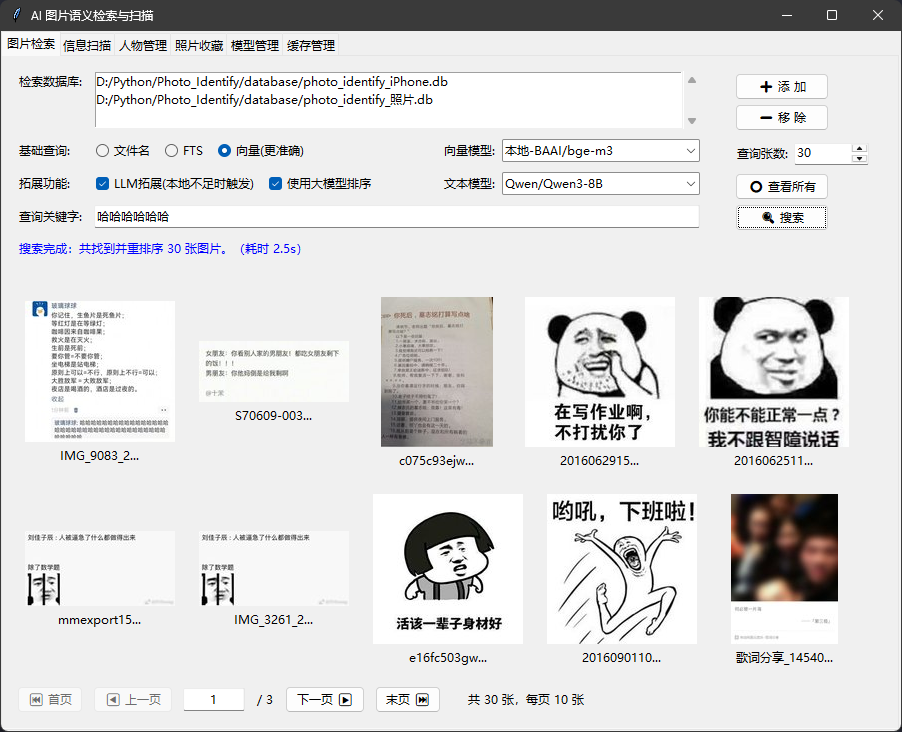

### 信息扫描

- 扫描本地媒体目录并入库
- 选择模型与数据库路径
- 观察扫描进度与日志

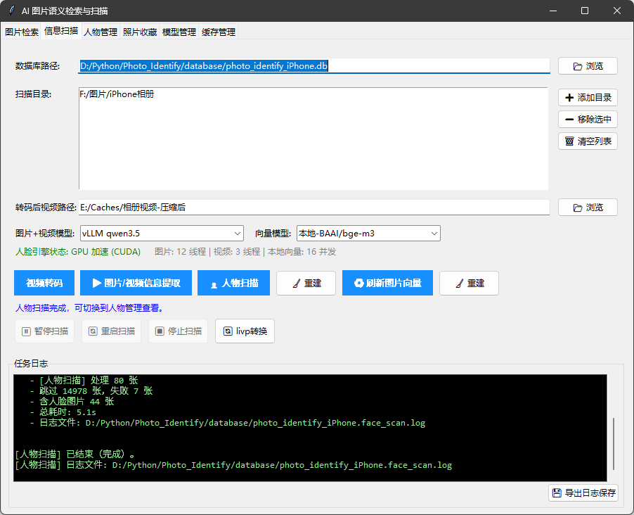

### 人物管理

- 人脸聚类与人物列表
- 人物合并与回收站
- 头像设置与照片浏览


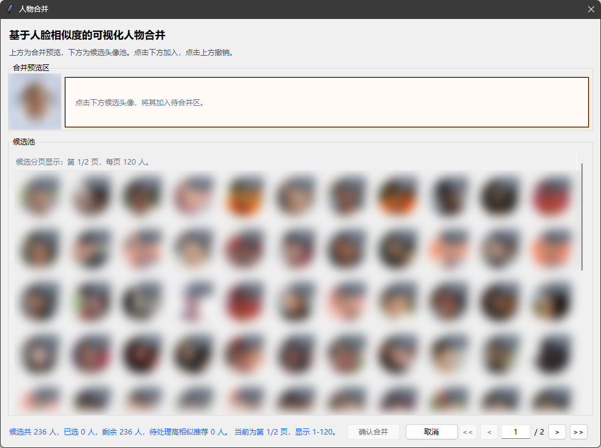

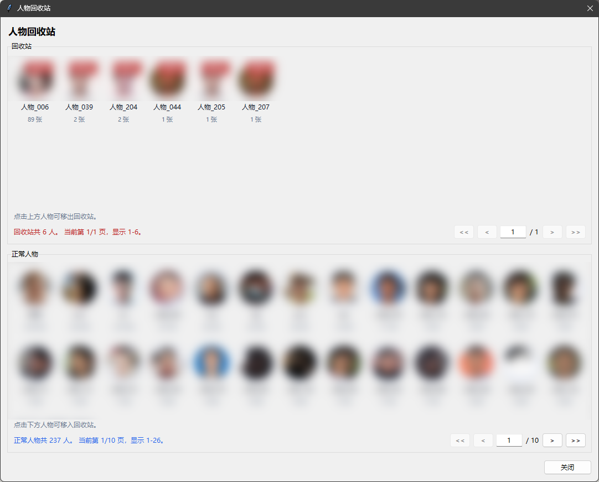

### 照片收藏

- 收藏/取消收藏
- 统一查看收藏结果

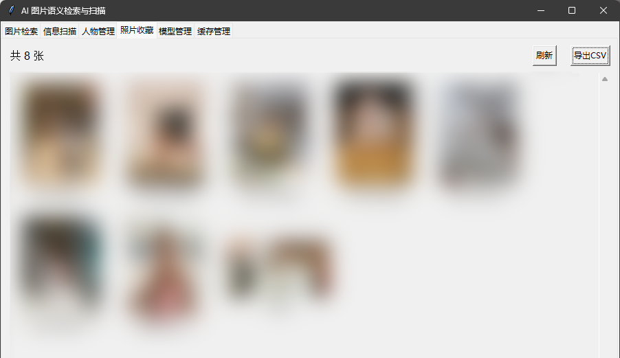

### 模型管理

- 管理云端本地/各类模型

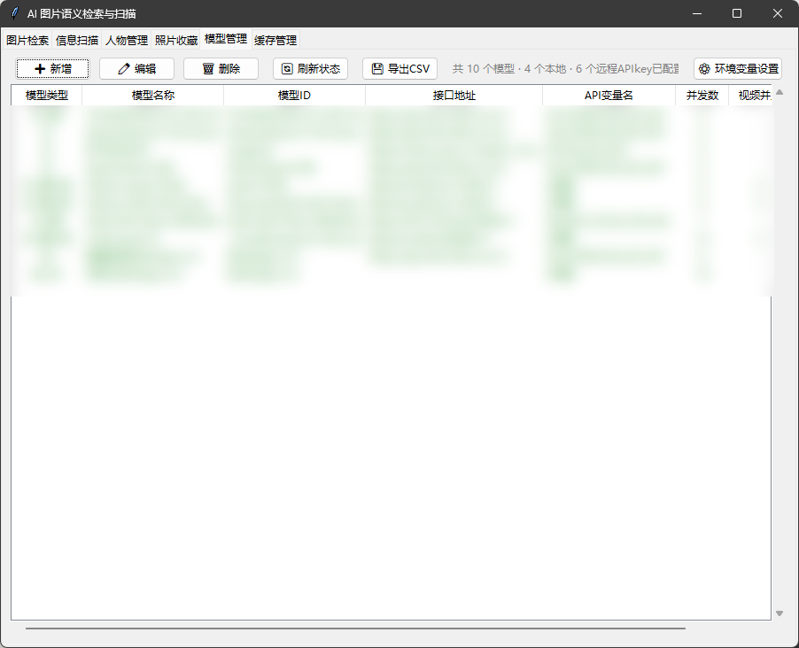


### 缓存管理

- 缓存目录与容量设置

  缓存用于加速各类列表中的缩略图、头像显示速度，建议目录放到SSD中。

- 缓存清理与重建

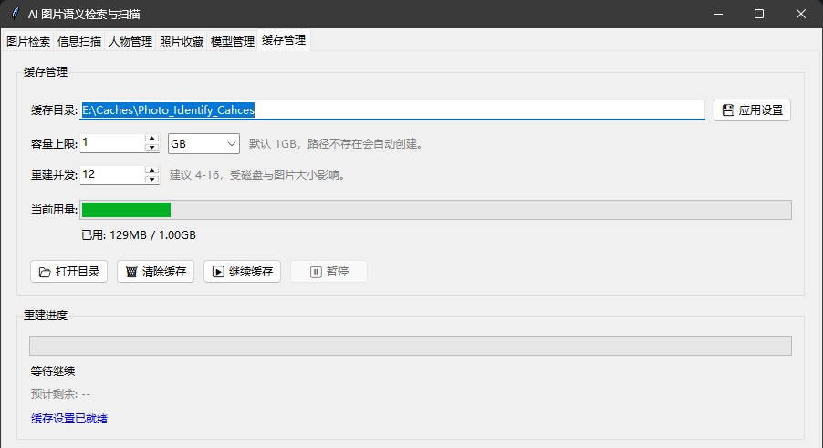

## 环境与安装

**非开发者（推荐）：** 双击 `install.bat` 即可自动安装所有依赖，无需手动配置环境。分发包内置了 `uv` 包管理工具，无需额外安装。

**源码开发者：** 请先安装 [uv](https://docs.astral.sh/uv/getting-started/installation/)，然后在项目目录执行 `uv sync` 安装依赖。

**大模型API要求：**

图片信息提取需要用到支持图片的多模态模型（API或者本地部署），视频提取可以采用支持视频的大模型，或者基于抽帧使用图片大模型（可能更慢）

**GPU 加速（可选，推荐）：**

人物提取、刷新图片向量、向量查询在有CUDA显卡支持时加速效果好，使用纯CPU等待时间可能较长。

若有 NVIDIA 独立显卡，安装以下组件后人脸识别和向量计算可获得显著加速。不安装也可正常使用，程序会自动回退到 CPU 模式。

1. **NVIDIA 显卡驱动** — 确保已安装最新版 [NVIDIA 驱动](https://www.nvidia.cn/drivers/)

2. **CUDA Toolkit 12.x** — 下载安装 [CUDA 12.8](https://developer.nvidia.com/cuda-downloads)（安装时可仅选"Runtime"组件）

   已测试兼容：cuda_12.8.0_571.96_windows.exe

3. **cuDNN 9.x** — 下载 [cuDNN 9](https://developer.nvidia.com/cudnn-downloads)并安装

   已测试兼容：cudnn_9.19.1_windows_x86_64.exe

4. 将 `bin/`、`include/`、`lib/` 中的文件复制到 CUDA 安装目录（如 `C:\Program Files\NVIDIA GPU Computing Toolkit\CUDA\v12.8\`）

安装完成后，确认 CUDA 的 `bin` 目录已加入系统 `PATH` 环境变量（安装程序通常会自动添加）。启动程序后，扫描页下方会显示 **"GPU 加速 (CUDA)"** 表示已生效；若显示 CPU 模式，请查看启动终端中的红字报错，常见原因是缺少 `cublasLt64_12.dll` 等 DLL 文件。

## 快速开始

### 1. 启动图形交互界面 (GUI)

**非开发者（推荐）：** 双击 `start_gui.bat` 启动程序。

源码开发者： 在项目目录运行

```bash
uv run python -m photo_identify
```

### 2.模型管理-->添加模型

添加至少一个文本模型和一个图片模型，建议增加视频模型（如Qwen3.5）

### 3.执行信息扫描

注意：视频转码、图片/视频信息提取可能耗时较久

转码后视频用于压缩视频码率，喂给视频大模型进行信息抽取，建议目录放到SSD中。

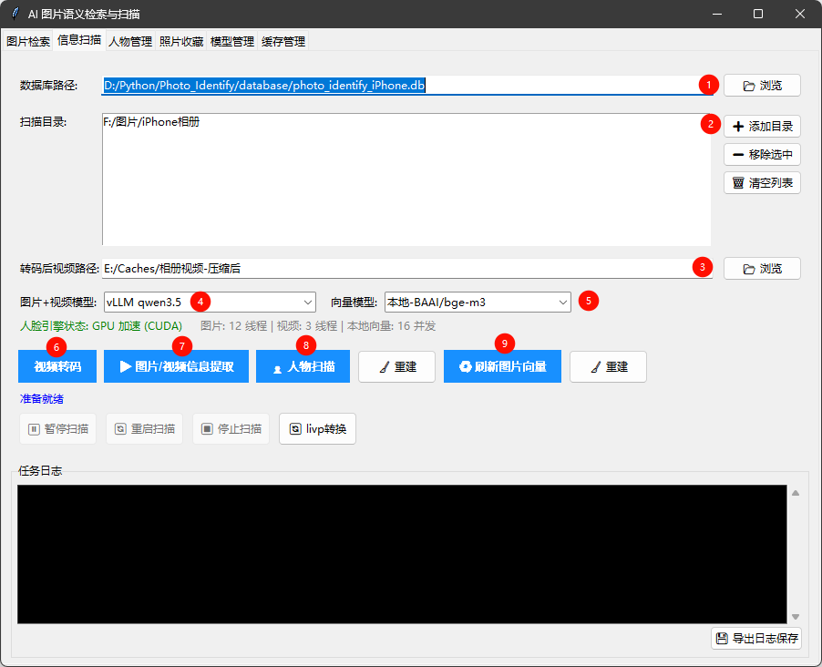

### 4.图片检索

进入图片检索页会显示数据库中的所有图片/视频

#### 查询方式

- 文件名查询：按文件名匹配，可输入完整文件名或文件名称的一部分

- FTS：简单文本分词查询，使用诸如"苹果"、"小马"等简单词汇效果最佳

- 向量查询：针对自然语言关键字效果最佳

#### 拓展功能

- 拓展功能在检索时需要文本模型支持

- LLM拓展：当关键词分词后找不到足够多内容时，尝试使用LLM来来拓展关键字。一般而言向量查询已足够，无需勾选拓展。
- 使用大模型排序：将检索结果发给大模型排序，部分场景排序更符合真实意图，请按需勾选。

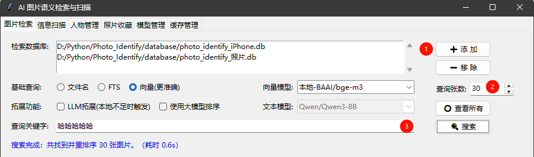

### 5.进阶交互

#### 右键交互

系统中多处支持右键菜单

- 图片预览界面-->预览图右键-->复制文件名/打开位置/收藏/编辑描述
- 人物管理-->人物列表右键-->重命名人物等
- 人物管理-->预览图右键-->设为头像等
- 人物管理-->人物合并/人物回收站-->头像右键：在主界面打开该头像的预览

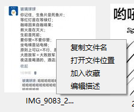

#### 快捷按钮

图片检索-->放大预览-->右上角-->按钮依次为：旋转/使用系统查看器打开/收藏（或取消收藏）

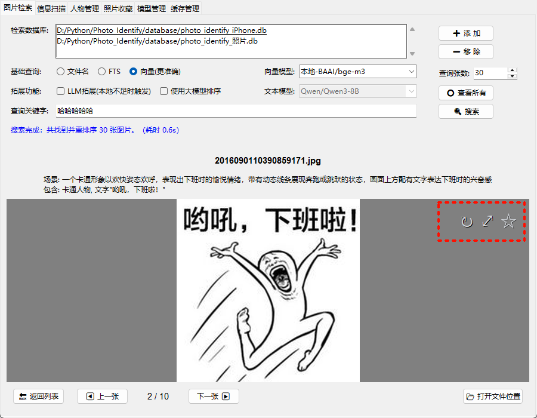

#### 编辑描述

对于大模型提取的信息不满意时，可以手动调整。

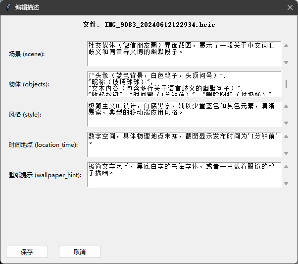


## 数据存储

数据存储在用户指定的本地SQLite数据库中，请妥善保管。

## 项目结构

```
Photo_Identify/
├── src/                        # 源码目录
│   ├── photo_identify/         # 主程序包
│   │   ├── __main__.py         # 程序入口
│   │   ├── gui.py              # 图形界面
│   │   ├── cli.py              # 命令行接口
│   │   ├── scanner.py          # 媒体扫描与信息提取
│   │   ├── search.py           # 图片/视频检索
│   │   ├── storage.py          # 数据库操作
│   │   ├── llm.py              # 大模型调用
│   │   ├── face_manager.py     # 人脸识别与管理
│   │   ├── person_merge.py     # 人物合并
│   │   ├── model_manager.py    # 模型配置管理
│   │   ├── embedding_runtime.py# 向量嵌入
│   │   ├── image_utils.py      # 图片处理工具
│   │   ├── cache_manager.py    # 缓存管理
│   │   ├── config.py           # 配置
│   │   └── runtime_compat.py   # 运行时兼容层
│   ├── video_edit/             # 视频处理
│   │   ├── video_compression.py# 视频转码压缩
│   │   └── video_reading.py    # 视频读取与抽帧
│   └── data_migration/         # 数据迁移工具
│       ├── lvip_decompression.py               # LVIP 格式解压
│       ├── backfill_text_embeddings.py         # 文本向量回填
│       └── clean_orphaned_foreign_key_records.py # 孤立外键清理
├── scripts/                    # 构建脚本
│   ├── build_portable.py       # 构建便携源码分发包
│   └── pyinstaller/            # PyInstaller 打包（归档）
│       ├── build_exe.py        # EXE 构建脚本
│       └── *.spec              # PyInstaller 规格文件
├── assets/                     # README 截图等静态资源
├── test/                       # 测试脚本
├── database/                   # 本地数据库（包含提取信息+模型信息，不入库）
├── dist/                   # 便携源码分发包（不入库）
├── install.bat                 # 一键安装依赖
├── start_gui.bat               # 一键启动 GUI
├── pyproject.toml              # 项目元数据与依赖声明
└── uv.lock                    # 依赖锁定文件
```

## 打包方式

```
uv run python scripts/build_portable.py
```

  产物在 dist/photo_identify_portable/，将整个文件夹分发给用户即可。
