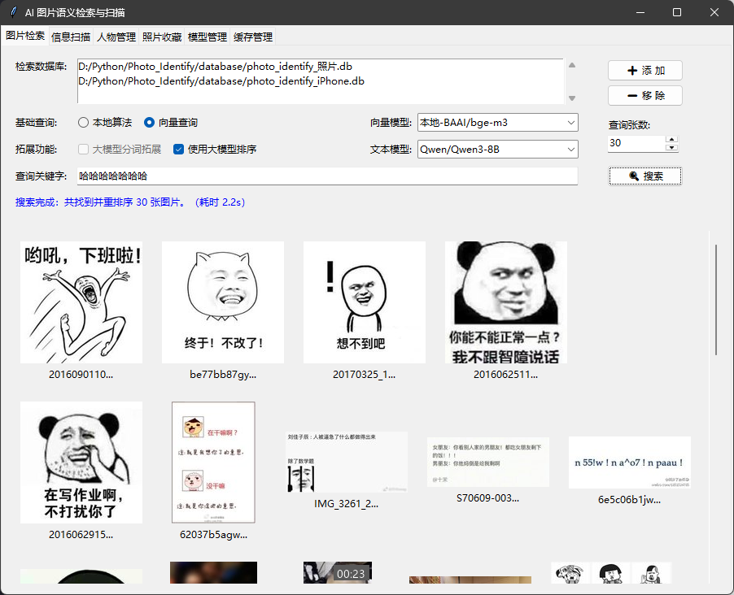
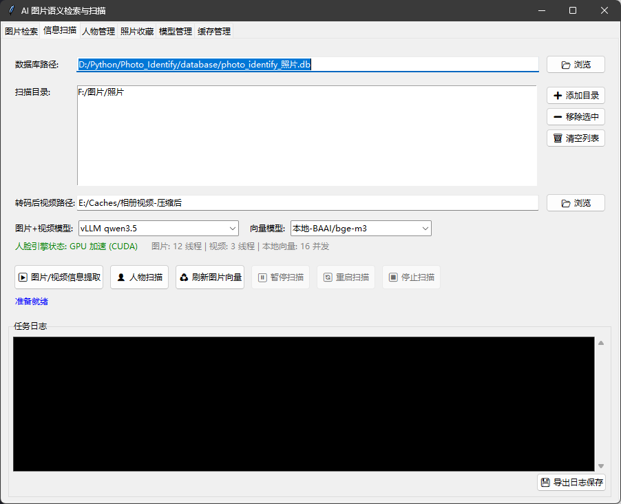
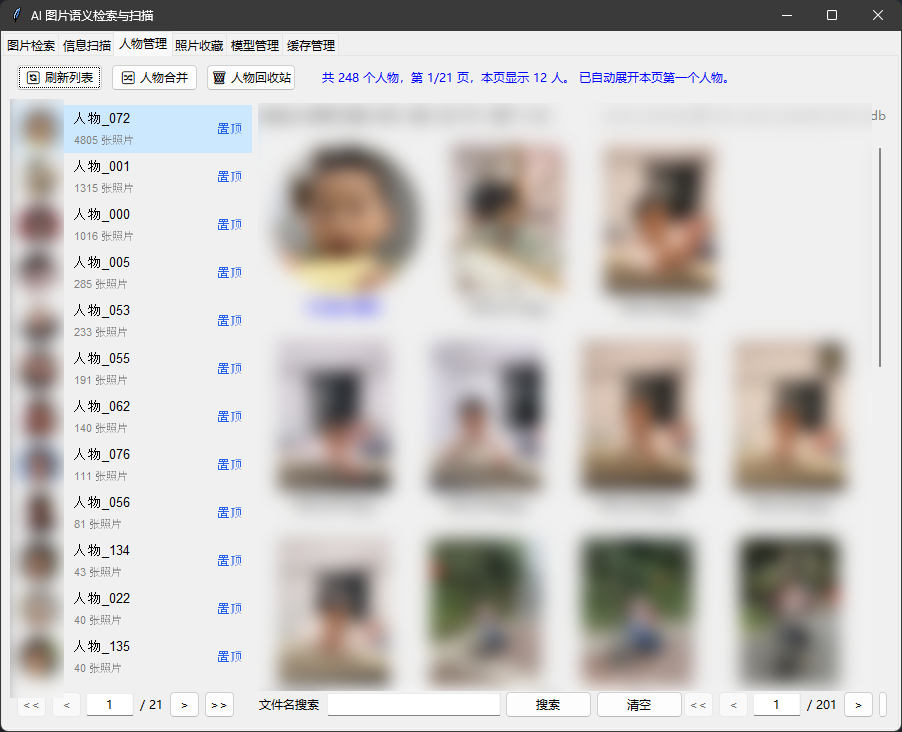
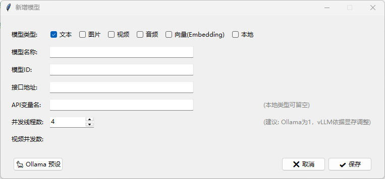
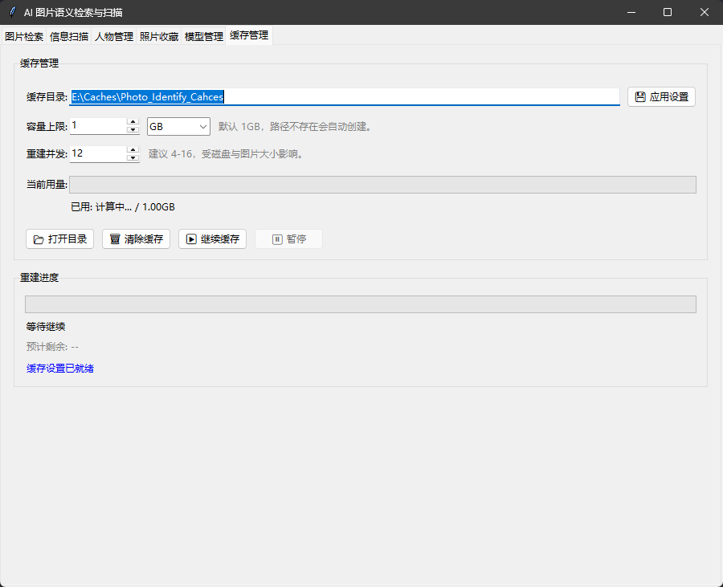

# Photo Identify

一款面向本地图片/视频的“智能相册”工具：先扫描分析媒体内容，再用自然语言快速找图。

## 能做什么（按标签页）

### 图片检索

- 自然语言搜索图片/视频
- Smart Search 扩展同义词
- 结果预览与定位



### 信息扫描

- 扫描本地媒体目录并入库
- 选择模型与数据库路径
- 观察扫描进度与日志



### 人物管理

- 人脸聚类与人物列表
- 人物合并与回收站
- 头像设置与照片浏览



### 照片收藏

- 收藏/取消收藏
- 统一查看收藏结果

### 模型管理

- 管理云端本地/各类模型



### 缓存管理

- 缓存目录与容量设置
- 缓存清理与重建



## 工作流程

1. 选择媒体目录 → 扫描分析 → 写入本地 SQLite 数据库
2. 进入检索/人物管理页面 → 浏览与筛选 → 自然语言检索
3. 需要时导出/导入数据库记录，或在 GUI 中管理缓存与模型

## 预置模型与服务

默认使用 **SiliconFlow (硅基流动)** 的 API 进行图片与文本推理：

- **默认图片模型**：`THUDM/GLM-4.1V-9B-Thinking`
- **默认文本处理模型**：`Qwen/Qwen2.5-7B-Instruct`

## 环境与安装

本项目使用现代 Python 包管理工具 `uv` 构建与执行。
请确保您已经安装了 [uv](https://github.com/astral-sh/uv)。

## 快速开始

本项目依赖于环境变量配置您的 API Key：

```bash
# Windows (PowerShell)
$env:SILICONFLOW_API_KEY="您的_API_KEY"

# Linux / macOS
export SILICONFLOW_API_KEY="您的_API_KEY"
```

*(如果未设置环境变量，也可在执行扫描/搜索时通过 `--api-key` 参数直接传入。)*

### 1. 启动图形交互界面 (GUI)

最简单的使用方式是启动自带的 GUI 面板进行点选工作。界面分为两大标签页：

- **图片检索**：支持自然语言以及大模型深度语义匹配查图。
- **信息扫描**：可视化地添加扫描目录、配置图片模型与数据库路径并观察扫描进度。
  *(注：GUI 中已移除明文 API Key 输入框，提供了便捷的“环境变量设置”系统交互按钮，一键配置全局 API Key)*

```bash
uv run python -m photo_identify gui
```

- ****所有交互都可以在GUI界面完成，以下非开发需求无需再看****

### 2. 使用命令行 (CLI) 扫描图片/视频目录

将指定路径（支持多个目录）下的所有图片和视频扫描入库：

> **💡 提示：扫描视频前建议执行视频压缩**
> 如果您的目录中包含大量原画质视频，建议在扫描前先使用压缩工具对视频进行压缩或转码。因为大模型对视频的理解分析存在大小限制，提前压缩不仅能大幅减少传输时间和 Token 消耗，还能避免扫描大视频时遇到 API 限制或由于读取过大文件导致的内存和性能瓶颈。
>
> 您可以执行以下命令使用项目中附带的压缩工具（自动遍历处理您的视频目录）：
>
> ```bash
> uv run python src/video_edit/video_compression.py
> ```

```bash
uv run python -m photo_identify scan --path "D:\Pictures" "E:\Downloads\Images"
```

常用可选参数：

- `--workers`：并发扫描的线程数（默认 `4`）。
- `--rpm` / `--tpm`：对 API 的请求频控调整。
- `--api-key`：直接传入 Key，不依赖环境变量。

### 3. 自然语言搜索

扫描入库后，可以使用自然语言描述搜索相关照片：

```bash
uv run python -m photo_identify search "海边的日落"
```

**智能扩展搜索 (Smart Search)**
加上 `--smart` 标志可通过大模型理解您的意图并扩展同义词进行搜索：

```bash
uv run python -m photo_identify search "海边的日落" --smart
```

*(注意：Smart 模式同样需要配置 `SILICONFLOW_API_KEY`)*

### 4. 数据统计与管理

**查看数据库统计信息**（包含总存储的图片记录数及数据库物理文件大小）：

```bash
uv run python -m photo_identify stats
```

**导出记录到 JSON 文件**：

```bash
uv run python -m photo_identify export --output backup.json
```

**从旧版/外部的 JSON 记录导入数据库**：

```bash
uv run python -m photo_identify import-json --input photo_analysis.json
```

## 数据存储

默认在项目根目录生成持久化的 `photo_identify.db` SQLite 数据库文件。你可以通过 `--db` 参数将数据库放置到其他存储路径。
